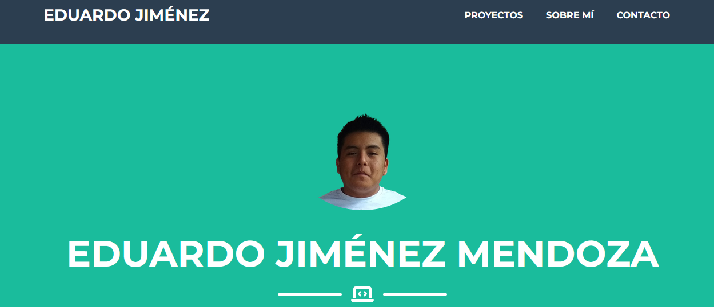
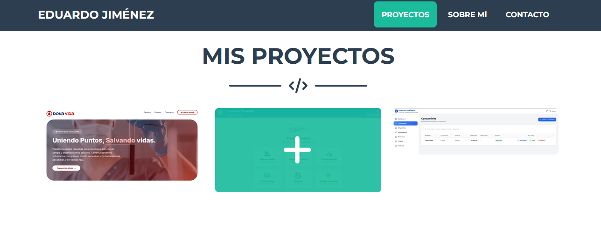

# Portafolio Personal - Eduardo Jiménez Mendoza

## 📖 Descripción del Proyecto
Este repositorio contiene el código fuente de mi portafolio web personal, desarrollado como parte de las prácticas de la materia. El objetivo principal es mostrar mis habilidades como estudiante de Ingeniería en Sistemas Computacionales, así como los proyectos de desarrollo de software y web en los que he trabajado.

* **Framework CSS utilizado:** Bootstrap 
* **Plantilla base:** freelance
* **Enlace de descarga de la plantilla:** https://startbootstrap.com/theme/freelancer

## 🗂️ Estructura y Secciones
El portafolio está compuesto por las siguientes secciones principales a través de un menú de navegación:

1. **Inicio (Hero):** Sección de bienvenida con mi nombre, título profesional y una fotografía formal.
2. **Sobre Mí (About):** Breve descripción de mi perfil como estudiante del Instituto Tecnológico de Oaxaca (ITO) y mis intereses en el desarrollo de software.
3. **Habilidades (Skills):** Listado de tecnologías que manejo, incluyendo lenguajes (Java, C#, JS, JavaScript), Stack MERN.
4. **Proyectos (Portfolio):** Galería interactiva mostrando desarrollos como "DonaVida", dos Sistemas de Gestión en C# WPF "Lavanderia" y en JavaScript, Css, html "Inventario de centro de computo" .
5. **Contacto (Contact):** Formulario de contacto y enlaces a mis redes profesionales (GitHub, LinkedIn).

## ⚙️ Proceso de Creación (Paso a Paso)
1. **Selección y Descarga:** Elegí la plantilla Freelancer debido a su diseño limpio y estructura responsiva.
2. **Limpieza de Código:** Eliminé secciones innecesarias que venían por defecto en la plantilla.
3. **Integración de Estilos:** Adapté la estructura de carpetas a los requerimientos del proyecto, moviendo los estilos al archivo `css/portafolio.css` y los scripts a `js/portafolio.js`.
4. **Personalización de Contenido:** * Reemplacé las imágenes de stock por capturas de mis proyectos reales (DonaVida, Ejercicios Web).
   * Agregué una fotografía profesional asegurando buena iluminación y fondo neutro.
   * Ajusté la paleta de colores nativa de Bootstrap para que coincidiera con mi identidad visual.
5. **Despliegue:** Inicialicé el repositorio en GitHub, subí los cambios y activé GitHub Pages desde la configuración del repositorio.

## 📸 Capturas de Pantalla

#
